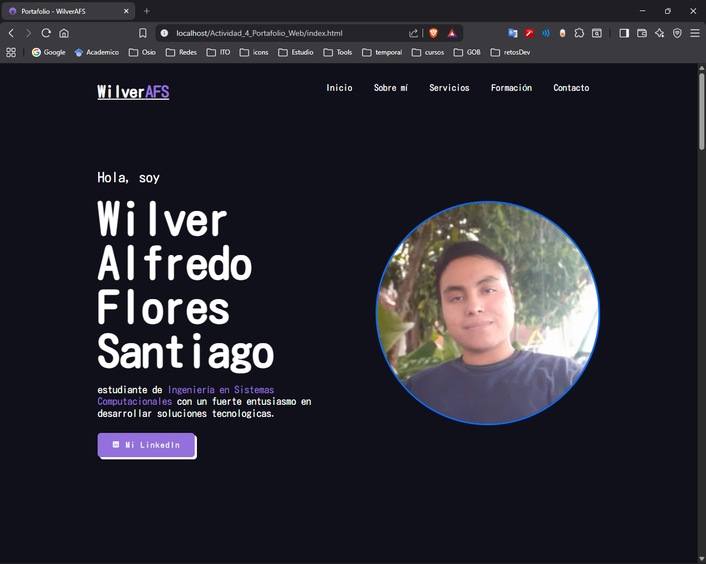
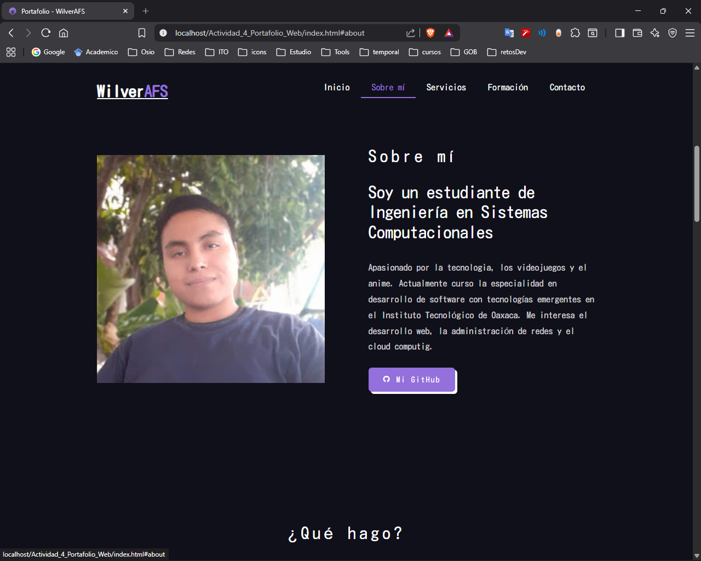
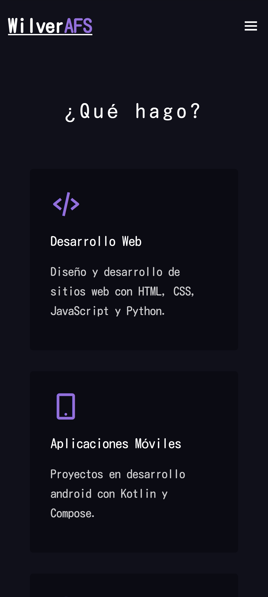
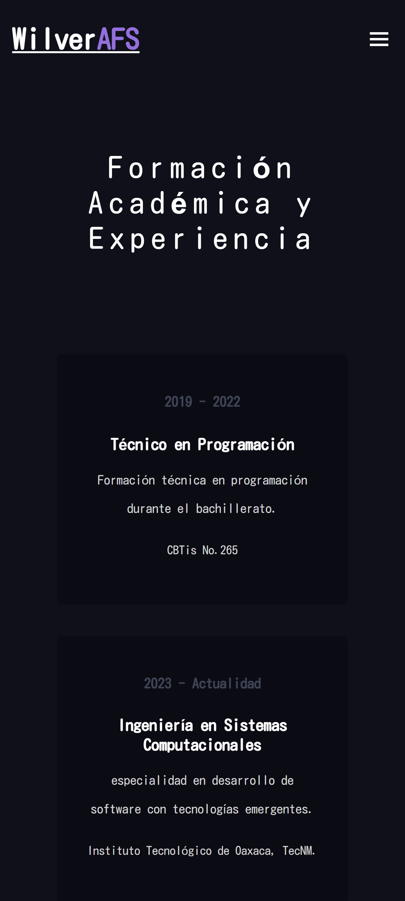

# Portafolio Personal - WilverAFS

**Nombre del proyecto:** Portafolio Personal  
**Autor:** Flores Santiago Wilver Alfredo
**Descripción breve:** Este proyecto es un portafolio personal desarrollado para la asignatura de programacion web. El objetivo es mostrar mi formación, habilidades y proyectos en un sitio web moderno y responsivo, basado en una plantilla, implementado Boostrapt y publicado en GitHub Pages.

---

## Descripción del proyecto
- **Framework CSS utilizado:** Se integró **Bootstrap 5** para utilidades específicas (imagen circular, bordes, íconos). El resto del diseño se mantiene con CSS personalizado.  
- **Plantilla utilizada:** [Anime Template de FreeFolio](https://github.com/OSSPhilippines/freefolio) (repositorio OSSPhilippines/freefolio, licencia MIT).  
- **Secciones del portafolio:**
  - **Inicio:** Presentación con mi nombre, foto de perfil circular (Bootstrap) y enlaces a LinkedIn.  
  - **Sobre mí:** Breve descripción personal y académica, con enlace a mi perfil de GitHub.  
  - **Servicios:** Áreas de conocimiento y práctica (desarrollo web, móvil, bases de datos, redes) con íconos de Boxicons y Bootstrap Icons.  
  - **Formación:** Educación y experiencia, incluyendo estudios en CBTis No.265 y el Instituto Tecnológico de Oaxaca, además de cursos y proyectos personales.  
  - **Contacto:** Formulario para enviar mensajes.  
  - **Footer:** Créditos y derechos reservados.

---

## Proceso de creación
1. **Selección de plantilla:** Se eligió la plantilla *Anime* del repositorio FreeFolio por su estilo moderno y adaptable.  
2. **Migración de archivos:**  
   - Los estilos se pasaron a `css/portafolio.css`.  
   - La lógica JavaScript se adaptó en `js/portafolio.js`.  
   - Las imágenes se organizaron en `img/`.  
3. **Adaptación de contenido:**  
   - Se reemplazaron los textos de ejemplo con mis datos personales, académicos y profesionales.  
   - Se añadieron botones personalizados para enlazar a mi perfil de GitHub y LinkedIn.  
   - Se ajustaron las secciones de formación y servicios para reflejar mis conocimientos actuales y proyectos.  
4. **Integración de Bootstrap:**  
   - Se usaron utilidades de Bootstrap para la imagen de perfil (`img-fluid`, `rounded-circle`, `border`).  
   - Se añadieron íconos de **Bootstrap Icons** en la sección de servicios.  
   - Se mantuvo la barra de navegación con estilos propios para evitar conflictos con Bootstrap.  
5. **Publicación:** El proyecto esta en un repositorio público de GitHub y se activó GitHub Pages para mostrar el portafolio en línea.  

---

## Capturas de pantalla
### Vista del portafolio desde nevegador de escritorio
  
  

### Vista del portafolio desde navegador móvil
  
  
---

## Enlaces
- **Repositorio en GitHub:** 
- **GitHub Pages (portafolio en vivo):** 

---

## Créditos
Este proyecto está basado en la plantilla Anime del repositorio [OSSPhilippines/freefolio](https://github.com/OSSPhilippines/freefolio), distribuida bajo licencia MIT.  
Se realizaron adaptaciones de contenido y estilo para personalizarlo con mis datos y objetivos académicos.
